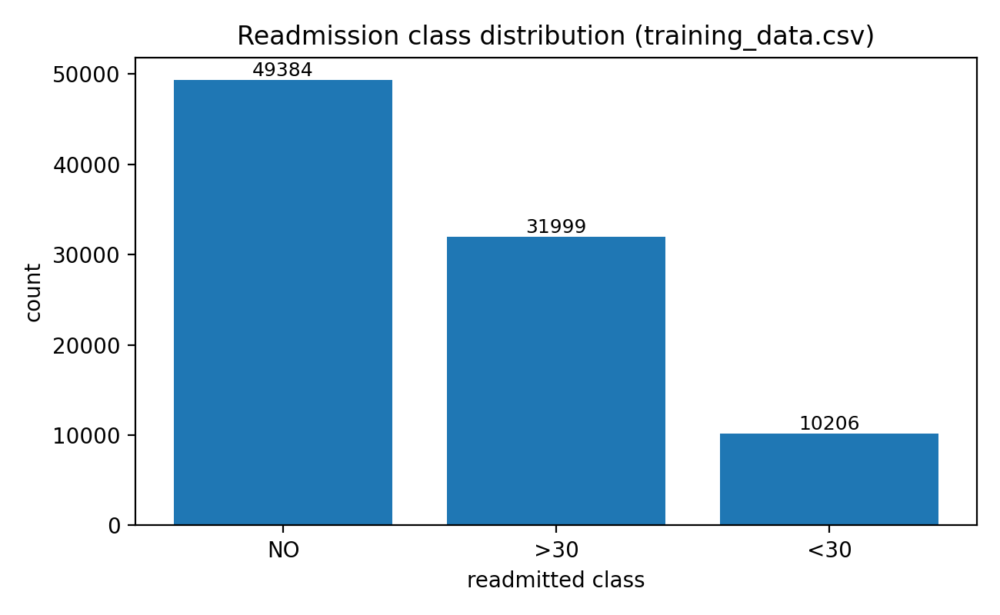

# Report Title + Authors
**Title**: Predicting hospital readmission with K-Nearest Neighbors (KNN)  
**Authors**: **Kaveh Zare** (*0000000*), **Edward Chhun** (*83878475*), **Kang Ji** (*56862533*), **Seth Flucas** (*0000000*)

## 1. Summary
In this project, we used `training_data.csv` (a tabular clinical dataset) to predict the multi-class label **`readmitted`** (classes: **`NO`**, **`>30`**, **`<30`**). We implemented a KNN classifier with preprocessing and feature selection to reduce the curse of dimensionality. Our main finding was that KNN performed best with **aggressive feature selection (30 features)** and a **large number of neighbors (around 280)**, reaching about **58% accuracy** on both validation and the held-out test split.

## 2. Data Description
### Dataset and target
- **Dataset**: `training_data.csv`
- **Task**: multi-class classification
- **Target**: `readmitted` \(\in \{NO, >30, <30\}\)

### Exploration performed
To understand the dataset, we inspected:
- missing values (including special missing tokens like `'?'` and `'Unknown/Invalid'`)
- distributions of key variables and the class distribution of `readmitted`
- skewness of numeric count-like features (to decide whether a log transform would help)

### Figure of Readmitted Class Distribution


### Prior published use of this dataset
This dataset is widely used in research on hospital readmission prediction. For example, **Strack et al. (2014)** studied this diabetes readmission dataset and analyzed factors related to readmission outcomes.

## 3. Classifiers
Below are the classification methods required by the project rubric. **In the current notebook, only KNN was fully implemented and evaluated; the remaining classifiers are described here for completeness and future extension.**

### 3.1 k-Nearest Neighbors (KNN) — implemented
KNN predicts a label for a new example by looking at the labels of its \(k\) closest training examples under a distance metric, optionally weighting neighbors by distance.  
- **Software**: scikit-learn `KNeighborsClassifier`  
- **Key hyperparameters explored**:
  - `n_neighbors`: 180, 200, 220, 240, 260, 280, 300, 320
  - `weights`: `uniform`, `distance`
  - `metric`: `minkowski`
  - `p`: 1 (Manhattan), 2 (Euclidean)
  - plus **feature selection size**: `SelectKBest k` in {20, 30, 40, 50}

### 3.2 Logistic Regression

### 3.3 Feedforward Neural Network (1+ hidden layer)

### 3.4 Random Forest Classifier (example)

## 4. Experimental Setup
### Metrics
In the notebook, we evaluated models using **classification accuracy**.

### Data partitioning
We used a reproducible hold-out split:
- **Train**: 90%
- **Test**: 10%
- `train_test_split(..., shuffle=True, random_state=1234)`

Within the training data, we performed **5-fold cross-validation** during hyperparameter tuning using `GridSearchCV(cv=5, scoring="accuracy")`.

### Preprocessing pipeline (reproducible)
Key preprocessing steps used before KNN:
- **Missing-value handling**: converted special missing tokens to `NaN`, then performed imputations/transformations so the modeling dataset had no missing values.
- **Encoding**:
  - ordinal variables encoded with `OrdinalEncoder` using explicit orderings (including medications and the ordered target encoding used during preprocessing)
  - non-ordinal categorical variables one-hot encoded using `pd.get_dummies(..., drop_first=True)`
- **Log transform**: applied `np.log1p` to selected skewed numeric features to reduce skewness.
- **Scaling**: standardized features with `StandardScaler` because KNN is distance-based.

### Hyperparameter selection procedure (pseudocode)
We selected hyperparameters using grid search with cross-validation:

```py
pipe = Pipeline([
    ("var", VarianceThreshold(threshold=0.0)),
    ("select", SelectKBest(score_func=f_classif)),
    ("knn", KNeighborsClassifier()),
])

param_grid = {
    "select__k": [20, 30, 40, 50],
    "knn__n_neighbors": [180, 200, 220, 240, 260, 280, 300, 320],
    "knn__weights": ["uniform", "distance"],
    "knn__metric": ["minkowski"],
    "knn__p": [1, 2]
}

grid_search = GridSearchCV(
    pipe,
    param_grid,
    cv=5,
    scoring="accuracy",
    n_jobs=-1
)
```

## 5. Experimental Results
### 5.1 KNN results
The best KNN pipeline found by cross-validation was:
- `VarianceThreshold(threshold=0.0)` -> remove constant features
- `SelectKBest(f_classif, k=30)` -> select top 30 features
- `KNeighborsClassifier(n_neighbors=280, weights="distance", metric="minkowski", p=1)`

**Best Cross Validation accuracy**: **0.5801**  
**Test accuracy**: **0.5799759799** (≈ **0.58**)

### 5.2 Logistic Regression results

### 5.3 FeedForward Neural Network results

### 5.1 Random Forest Classifier results


### Results table (test set)
| Classifier | Implemented? | Main tuned settings | Test accuracy |
|---|---:|---|---:|
| KNN | Yes | `k_features=30`, `n_neighbors=280`, `weights=distance`, `p=1` | ~0.58 |
| Logistic regression | No | planned | — |
| Feedforward neural net | No | planned | — |
| Additional classifier (e.g., RF/GBDT) | No | planned | — |

## 6. Insights
- **Curse of dimensionality mattered**: starting from ~150+ features after encoding, KNN benefited from reducing dimensionality using `SelectKBest`.
- **Large neighbor counts worked best**: the best-performing setting used **high `n_neighbors` (~280)**, consistent with the idea that the dataset is noisy and smoothing improves generalization.
- **Scaling was essential**: feature standardization is necessary so no single feature dominates distance computations purely due to scale.
- **Dropping near-constant features was not enough**: trying to remove near-constant categorical features did not improve performance by itself in the notebook’s experiments.

## 7. Contributions
- **Kaveh Zare**: Feed Forward Neureal Network, data cleaning/imputation, encoding strategy, and initial EDA.
- **Edward Chhun**: KNN pipeline construction, hyperparameter tuning with `GridSearchCV`.
- **Kang Ji**:  Random Forest Classifier.
- **Seth Flucas**: Logistic Classifier.

